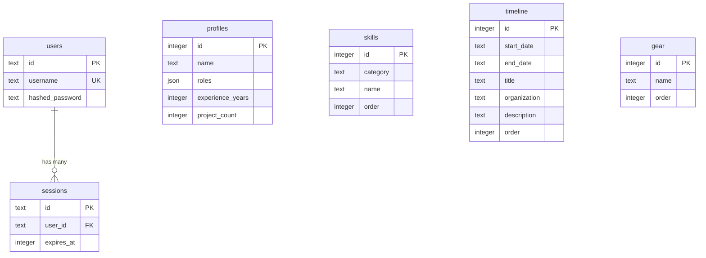

# データベース設計書

## 1. データベース概要

### 基本情報

- **RDBMS**: SQLite 3
- **ORM**: Drizzle ORM v0.36.0
- **ドライバー**: better-sqlite3 v11.0.0
- **マイグレーションツール**: drizzle-kit v0.28.0
- **ファイルパス**: `./data.db` (プロジェクトルート)

### 選定理由

- **SQLite**: サーバーレス、ゼロ設定、ファイルベース
- **Drizzle ORM**: 型安全、軽量、パフォーマンス優秀
- **移行方針**: 既存のスキーマとORM設定をそのまま継承

## 2. テーブル設計

### 2.1 ER図



### 2.2 テーブル詳細

#### 2.2.1 `users` (認証用ユーザー)

| カラム名        | 型   | 制約             | 説明                       |
| --------------- | ---- | ---------------- | -------------------------- |
| id              | TEXT | PRIMARY KEY      | ユーザーID (Lucia生成)     |
| username        | TEXT | NOT NULL, UNIQUE | ログインユーザー名         |
| hashed_password | TEXT | NOT NULL         | Argon2ハッシュ化パスワード |

**制約**:

- `username` は重複不可
- `id` は Lucia が自動生成 (ULID形式推奨)

**用途**:

- 管理者ログイン認証

---

#### 2.2.2 `sessions` (セッション管理)

| カラム名   | 型      | 制約                  | 説明                                |
| ---------- | ------- | --------------------- | ----------------------------------- |
| id         | TEXT    | PRIMARY KEY           | セッションID (Lucia生成)            |
| user_id    | TEXT    | NOT NULL, FOREIGN KEY | ユーザーID                          |
| expires_at | INTEGER | NOT NULL              | セッション有効期限 (Unix timestamp) |

**外部キー**:

- `user_id` → `users.id` (CASCADE DELETE)

**インデックス**:

- `user_id` にインデックス推奨 (検索高速化)

**用途**:

- Lucia Auth のセッション管理

---

#### 2.2.3 `profiles` (プロフィール情報)

| カラム名         | 型          | 制約        | 説明                                                 |
| ---------------- | ----------- | ----------- | ---------------------------------------------------- |
| id               | INTEGER     | PRIMARY KEY | プロフィールID (固定: 1)                             |
| name             | TEXT        | NOT NULL    | 表示名                                               |
| roles            | TEXT (JSON) | NOT NULL    | 役割リスト (例: ["Backend Engineer", "ML Engineer"]) |
| experience_years | INTEGER     | NOT NULL    | 経験年数                                             |
| project_count    | INTEGER     | NOT NULL    | プロジェクト数                                       |

**データ例**:

```json
{
    "id": 1,
    "name": "金ヶ江陵太",
    "roles": ["Backend Engineer", "ML Engineer"],
    "experience_years": 5,
    "project_count": 20
}
```

**注意点**:

- 現在は単一レコード運用 (`id = 1`)
- 将来的に複数プロフィール対応も可能

---

#### 2.2.4 `skills` (スキル一覧)

| カラム名 | 型      | 制約                      | 説明                                           |
| -------- | ------- | ------------------------- | ---------------------------------------------- |
| id       | INTEGER | PRIMARY KEY AUTOINCREMENT | スキルID                                       |
| category | TEXT    | NOT NULL, ENUM            | カテゴリ ('languages', 'frameworks', 'others') |
| name     | TEXT    | NOT NULL                  | スキル名 (例: "TypeScript", "React")           |
| order    | INTEGER | NOT NULL                  | 表示順序                                       |

**カテゴリー**:

- `languages`: プログラミング言語
- `frameworks`: フレームワーク・ライブラリ
- `others`: その他ツール・技術

**制約**:

- `category` は ENUM ('languages', 'frameworks', 'others')

**インデックス**:

- `order` にインデックス推奨 (ソート高速化)

---

#### 2.2.5 `timeline` (経歴タイムライン)

| カラム名     | 型      | 制約                      | 説明                            |
| ------------ | ------- | ------------------------- | ------------------------------- |
| id           | INTEGER | PRIMARY KEY AUTOINCREMENT | タイムラインID                  |
| start_date   | TEXT    | NOT NULL                  | 開始日 (ISO 8601: "YYYY-MM-DD") |
| end_date     | TEXT    | NULLABLE                  | 終了日 (NULL = 現在進行中)      |
| title        | TEXT    | NOT NULL                  | タイトル (例: "株式会社◯◯入社") |
| organization | TEXT    | NULLABLE                  | 組織名                          |
| description  | TEXT    | NOT NULL                  | 詳細説明                        |
| order        | INTEGER | NOT NULL                  | 表示順序                        |

**データ例**:

```json
{
    "id": 1,
    "start_date": "2020-04-01",
    "end_date": "2022-03-31",
    "title": "Backend Engineer",
    "organization": "株式会社サンプル",
    "description": "マイクロサービスの設計・開発",
    "order": 1
}
```

**インデックス**:

- `order` にインデックス推奨

---

#### 2.2.6 `gear` (使用機材)

| カラム名 | 型      | 制約                      | 説明                               |
| -------- | ------- | ------------------------- | ---------------------------------- |
| id       | INTEGER | PRIMARY KEY AUTOINCREMENT | ギアID                             |
| name     | TEXT    | NOT NULL                  | 機材名 (例: "MacBook Pro 16-inch") |
| order    | INTEGER | NOT NULL                  | 表示順序                           |

**インデックス**:

- `order` にインデックス推奨

---

## 3. Drizzle ORM スキーマ定義

既存のスキーマファイル: `src/lib/db/schema.ts`

**移行後の配置**:

```
backend/src/lib/db/schema.ts
```

スキーマ定義は変更なし（そのまま移行）。

---

## 4. マイグレーション戦略

### 4.1 現在のマイグレーション管理

**設定ファイル**: `drizzle.config.ts`

```typescript
import { defineConfig } from 'drizzle-kit';

export default defineConfig({
    dialect: 'sqlite',
    schema: './src/lib/db/schema.ts',
    out: './drizzle',
});
```

### 4.2 移行後の設定

**新しいパス**: `backend/drizzle.config.ts`

```typescript
import { defineConfig } from 'drizzle-kit';

export default defineConfig({
    dialect: 'sqlite',
    schema: './src/lib/db/schema.ts',
    out: '../drizzle', // ルートのdrizzleディレクトリを共有
    dbCredentials: {
        url: '../data.db',
    },
});
```

### 4.3 マイグレーションコマンド

```bash
# スキーマ変更時
cd backend
pnpm db:generate  # drizzle-kit generate

# データベースに適用
pnpm db:push      # drizzle-kit push
```

---

## 5. データベース初期化

### 5.1 初期データ投入

**スクリプト**: `backend/src/scripts/seed.ts` (新規作成)

```typescript
import { db } from '../lib/db';
import { users, profiles } from '../lib/db/schema';
import { hash } from '@node-rs/argon2';

async function seed() {
    const adminUsername = process.env.ADMIN_USERNAME || 'admin';
    const adminPassword = process.env.ADMIN_PASSWORD || 'changeme';

    const hashedPassword = await hash(adminPassword, {
        memoryCost: 19456,
        timeCost: 2,
        outputLen: 32,
        parallelism: 1,
    });

    // 管理者ユーザー作成
    await db.insert(users).values({
        id: 'admin_user_id',
        username: adminUsername,
        hashedPassword: hashedPassword,
    });

    // プロフィール初期化
    await db.insert(profiles).values({
        id: 1,
        name: 'Your Name',
        roles: ['Developer'],
        experienceYears: 0,
        projectCount: 0,
    });
}

seed();
```

**実行**:

```bash
cd backend
pnpm tsx src/scripts/seed.ts
```

---

## 6. クエリパフォーマンス最適化

### 6.1 推奨インデックス

```sql
CREATE INDEX idx_sessions_user_id ON sessions(user_id);
CREATE INDEX idx_skills_order ON skills(order);
CREATE INDEX idx_timeline_order ON timeline(order);
CREATE INDEX idx_gear_order ON gear(order);
```

### 6.2 クエリ最適化

**頻出クエリ**:

1. セッション検証: `SELECT * FROM sessions WHERE id = ?`
2. スキル一覧取得: `SELECT * FROM skills ORDER BY order ASC`
3. タイムライン一覧: `SELECT * FROM timeline ORDER BY order ASC`

**最適化方針**:

- `ORDER BY` が頻繁なカラムにインデックス
- N+1 問題に注意（Drizzle の `with` 句活用）

---

## 7. バックアップ戦略

### 7.1 SQLite バックアップ

**方法1**: ファイルコピー

```bash
cp data.db data.db.backup
```

**方法2**: SQLite コマンド

```bash
sqlite3 data.db ".backup data.db.backup"
```

### 7.2 自動バックアップ（推奨）

**Cron ジョブ例**:

```bash
0 2 * * * cp /path/to/data.db /path/to/backups/data.db.$(date +\%Y\%m\%d)
```

---

## 8. データベース移行チェックリスト

- [x] 既存スキーマの確認
- [ ] `backend/src/lib/db/schema.ts` へコピー
- [ ] `drizzle.config.ts` を backend に配置
- [ ] データベースファイルパスの調整
- [ ] マイグレーション実行
- [ ] 初期データ投入スクリプト作成
- [ ] インデックス作成
- [ ] バックアップ戦略の実装
