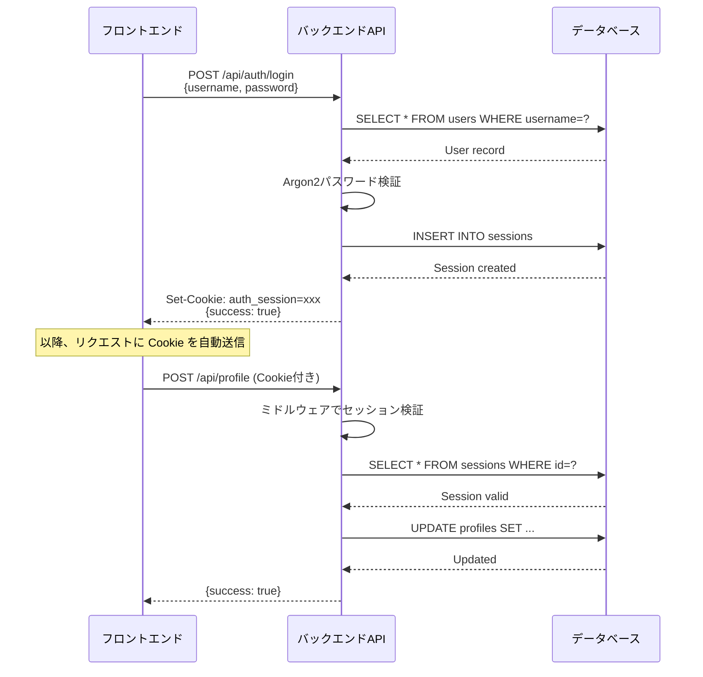

# API仕様書

## 1. API概要

### ベースURL

- **開発環境**: `http://localhost:4000/api`
- **本番環境**: `https://www.gae-jp.net/api`

### 認証方式

- **方式**: Cookie ベースセッション認証
- **Cookie名**: `auth_session` (Lucia デフォルト)
- **認証ヘッダー**: 不要（Cookie を自動送信）

### データフォーマット

- **リクエスト**: `application/json`
- **レスポンス**: `application/json`

### エラーレスポンス形式

```json
{
    "error": "エラーメッセージ"
}
```

---

## 2. エンドポイント一覧

| カテゴリ         | メソッド | エンドポイント      | 認証 | 説明             |
| ---------------- | -------- | ------------------- | ---- | ---------------- |
| **認証**         | POST     | `/api/auth/login`   | ❌   | ログイン         |
| **認証**         | POST     | `/api/auth/logout`  | ✅   | ログアウト       |
| **プロフィール** | POST     | `/api/profile`      | ✅   | プロフィール更新 |
| **スキル**       | POST     | `/api/skills`       | ✅   | スキル作成       |
| **スキル**       | DELETE   | `/api/skills/:id`   | ✅   | スキル削除       |
| **タイムライン** | POST     | `/api/timeline`     | ✅   | タイムライン作成 |
| **タイムライン** | PUT      | `/api/timeline/:id` | ✅   | タイムライン更新 |
| **タイムライン** | DELETE   | `/api/timeline/:id` | ✅   | タイムライン削除 |
| **ギア**         | POST     | `/api/gear`         | ✅   | ギア作成         |
| **ギア**         | DELETE   | `/api/gear/:id`     | ✅   | ギア削除         |

---

## 3. エンドポイント詳細

### 3.1 認証API

#### 3.1.1 ログイン

**エンドポイント**: `POST /api/auth/login`

**説明**: ユーザーネーム・パスワードでログインし、セッションCookieを発行

**認証**: 不要

**リクエストボディ**:

```json
{
    "username": "admin",
    "password": "password123"
}
```

**リクエストスキーマ**:

```typescript
{
    username: string;
    password: string;
}
```

**レスポンス**: `200 OK`

```json
{
    "success": true
}
```

**Set-Cookie**:

```
auth_session=<session_id>; Path=/; HttpOnly; SameSite=Lax; Max-Age=2592000
```

**エラーレスポンス**:

| ステータス         | 説明                           | レスポンス                         |
| ------------------ | ------------------------------ | ---------------------------------- |
| `400 Bad Request`  | ユーザー名またはパスワードが空 | `{"error": "Invalid credentials"}` |
| `401 Unauthorized` | ユーザー名・パスワード不正     | `{"error": "Invalid credentials"}` |

**ビジネスロジック**:

1. リクエストボディから `username`, `password` を取得
2. `users` テーブルから `username` でユーザー検索
3. パスワードを Argon2 で検証
4. Lucia でセッション作成 → Cookie 設定
5. 成功レスポンス返却

---

#### 3.1.2 ログアウト

**エンドポイント**: `POST /api/auth/logout`

**説明**: セッションを無効化し、Cookieをクリア

**認証**: 必須

**リクエストボディ**: なし

**レスポンス**: `302 Found` (リダイレクト)

**ヘッダー**:

```
Location: /admin/login
```

**Set-Cookie** (クリア):

```
auth_session=; Path=/; HttpOnly; SameSite=Lax; Max-Age=0
```

**エラーレスポンス**:

| ステータス         | 説明             |
| ------------------ | ---------------- |
| `401 Unauthorized` | セッション未認証 |

**ビジネスロジック**:

1. ミドルウェアでセッション検証
2. Lucia でセッション無効化 (`invalidateSession`)
3. 空の Cookie 設定
4. `/admin/login` へリダイレクト

---

### 3.2 プロフィールAPI

#### 3.2.1 プロフィール更新

**エンドポイント**: `POST /api/profile`

**説明**: プロフィール情報を更新（id=1 固定）

**認証**: 必須

**リクエストボディ**:

```json
{
    "name": "金ヶ江陵太",
    "roles": ["Backend Engineer", "ML Engineer"],
    "experienceYears": "5",
    "projectCount": "20"
}
```

**リクエストスキーマ**:

```typescript
{
  name: string;
  roles: string[];
  experienceYears: string; // 数値文字列
  projectCount: string;    // 数値文字列
}
```

**レスポンス**: `200 OK`

```json
{
    "success": true
}
```

**エラーレスポンス**:

| ステータス                  | 説明             | レスポンス                              |
| --------------------------- | ---------------- | --------------------------------------- |
| `401 Unauthorized`          | セッション未認証 | `{"error": "Unauthorized"}`             |
| `500 Internal Server Error` | DB更新失敗       | `{"error": "Failed to update profile"}` |

**ビジネスロジック**:

1. ミドルウェアでセッション検証
2. リクエストボディから更新データ取得
3. `experienceYears`, `projectCount` を整数に変換
4. `profiles` テーブルの `id=1` を UPDATE
5. 成功レスポンス返却

---

### 3.3 スキルAPI

#### 3.3.1 スキル作成

**エンドポイント**: `POST /api/skills`

**説明**: 新しいスキルを追加

**認証**: 必須

**リクエストボディ**:

```json
{
    "name": "TypeScript",
    "category": "languages"
}
```

**リクエストスキーマ**:

```typescript
{
    name: string;
    category: 'languages' | 'frameworks' | 'others';
}
```

**レスポンス**: `200 OK`

```json
{
    "success": true
}
```

**エラーレスポンス**:

| ステータス                  | 説明             | レスポンス                            |
| --------------------------- | ---------------- | ------------------------------------- |
| `401 Unauthorized`          | セッション未認証 | `{"error": "Unauthorized"}`           |
| `500 Internal Server Error` | DB挿入失敗       | `{"error": "Failed to create skill"}` |

**ビジネスロジック**:

1. ミドルウェアでセッション検証
2. 現在の最大 `order` 値を取得
3. 新しい `order` = `maxOrder + 1`
4. `skills` テーブルに INSERT
5. 成功レスポンス返却

---

#### 3.3.2 スキル削除

**エンドポイント**: `DELETE /api/skills/:id`

**説明**: 指定IDのスキルを削除

**認証**: 必須

**パスパラメーター**:

- `id` (integer): スキルID

**レスポンス**: `200 OK`

```json
{
    "success": true
}
```

**エラーレスポンス**:

| ステータス                  | 説明             | レスポンス                            |
| --------------------------- | ---------------- | ------------------------------------- |
| `401 Unauthorized`          | セッション未認証 | `{"error": "Unauthorized"}`           |
| `500 Internal Server Error` | DB削除失敗       | `{"error": "Failed to delete skill"}` |

**ビジネスロジック**:

1. ミドルウェアでセッション検証
2. パスパラメーターから `id` 取得 → 整数変換
3. `skills` テーブルから `id` で DELETE
4. 成功レスポンス返却

---

### 3.4 タイムラインAPI

#### 3.4.1 タイムライン作成

**エンドポイント**: `POST /api/timeline`

**説明**: 新しいタイムライン項目を追加

**認証**: 必須

**リクエストボディ**:

```json
{
    "startDate": "2020-04-01",
    "endDate": "2022-03-31",
    "title": "Backend Engineer",
    "organization": "株式会社サンプル",
    "description": "マイクロサービスの設計・開発を担当"
}
```

**リクエストスキーマ**:

```typescript
{
  startDate: string;      // ISO 8601 (YYYY-MM-DD)
  endDate?: string;       // オプショナル (null = 現在進行中)
  title: string;
  organization?: string;  // オプショナル
  description: string;
}
```

**レスポンス**: `200 OK`

```json
{
    "success": true
}
```

**エラーレスポンス**:

| ステータス                  | 説明             | レスポンス                               |
| --------------------------- | ---------------- | ---------------------------------------- |
| `401 Unauthorized`          | セッション未認証 | `{"error": "Unauthorized"}`              |
| `500 Internal Server Error` | DB挿入失敗       | `{"error": "Failed to create timeline"}` |

**ビジネスロジック**:

1. ミドルウェアでセッション検証
2. 現在の最大 `order` 値を取得
3. 新しい `order` = `maxOrder + 1`
4. `timeline` テーブルに INSERT
5. 成功レスポンス返却

---

#### 3.4.2 タイムライン更新

**エンドポイント**: `PUT /api/timeline/:id`

**説明**: 指定IDのタイムライン項目を更新

**認証**: 必須

**パスパラメーター**:

- `id` (integer): タイムラインID

**リクエストボディ**:

```json
{
    "startDate": "2020-04-01",
    "endDate": null,
    "title": "Senior Backend Engineer",
    "organization": "株式会社サンプル",
    "description": "技術リーダーとしてアーキテクチャ設計を主導"
}
```

**リクエストスキーマ**:

```typescript
{
  startDate: string;
  endDate?: string | null;
  title: string;
  organization?: string | null;
  description: string;
}
```

**レスポンス**: `200 OK`

```json
{
    "success": true
}
```

**エラーレスポンス**:

| ステータス                  | 説明             | レスポンス                               |
| --------------------------- | ---------------- | ---------------------------------------- |
| `401 Unauthorized`          | セッション未認証 | `{"error": "Unauthorized"}`              |
| `500 Internal Server Error` | DB更新失敗       | `{"error": "Failed to update timeline"}` |

**ビジネスロジック**:

1. ミドルウェアでセッション検証
2. パスパラメーターから `id` 取得
3. リクエストボディから更新データ取得
4. `timeline` テーブルの `id` で UPDATE
5. 成功レスポンス返却

---

#### 3.4.3 タイムライン削除

**エンドポイント**: `DELETE /api/timeline/:id`

**説明**: 指定IDのタイムライン項目を削除

**認証**: 必須

**パスパラメーター**:

- `id` (integer): タイムラインID

**レスポンス**: `200 OK`

```json
{
    "success": true
}
```

**エラーレスポンス**:

| ステータス                  | 説明             | レスポンス                               |
| --------------------------- | ---------------- | ---------------------------------------- |
| `401 Unauthorized`          | セッション未認証 | `{"error": "Unauthorized"}`              |
| `500 Internal Server Error` | DB削除失敗       | `{"error": "Failed to delete timeline"}` |

**ビジネスロジック**:

1. ミドルウェアでセッション検証
2. パスパラメーターから `id` 取得
3. `timeline` テーブルから `id` で DELETE
4. 成功レスポンス返却

---

### 3.5 ギアAPI

#### 3.5.1 ギア作成

**エンドポイント**: `POST /api/gear`

**説明**: 新しいギア（機材）を追加

**認証**: 必須

**リクエストボディ**:

```json
{
    "name": "MacBook Pro 16-inch"
}
```

**リクエストスキーマ**:

```typescript
{
    name: string;
}
```

**レスポンス**: `200 OK`

```json
{
    "success": true
}
```

**エラーレスポンス**:

| ステータス                  | 説明             | レスポンス                           |
| --------------------------- | ---------------- | ------------------------------------ |
| `401 Unauthorized`          | セッション未認証 | `{"error": "Unauthorized"}`          |
| `500 Internal Server Error` | DB挿入失敗       | `{"error": "Failed to create gear"}` |

**ビジネスロジック**:

1. ミドルウェアでセッション検証
2. 現在の最大 `order` 値を取得
3. 新しい `order` = `maxOrder + 1`
4. `gear` テーブルに INSERT
5. 成功レスポンス返却

---

#### 3.5.2 ギア削除

**エンドポイント**: `DELETE /api/gear/:id`

**説明**: 指定IDのギアを削除

**認証**: 必須

**パスパラメーター**:

- `id` (integer): ギアID

**レスポンス**: `200 OK`

```json
{
    "success": true
}
```

**エラーレスポンス**:

| ステータス                  | 説明             | レスポンス                           |
| --------------------------- | ---------------- | ------------------------------------ |
| `401 Unauthorized`          | セッション未認証 | `{"error": "Unauthorized"}`          |
| `500 Internal Server Error` | DB削除失敗       | `{"error": "Failed to delete gear"}` |

**ビジネスロジック**:

1. ミドルウェアでセッション検証
2. パスパラメーターから `id` 取得
3. `gear` テーブルから `id` で DELETE
4. 成功レスポンス返却

---

## 4. 認証フロー

### 4.1 ログインフローシーケンス



### 4.2 ログアウトフロー

```mermaid
sequenceDiagram
    participant Client as フロントエンド
    participant API as バックエンドAPI
    participant DB as データベース

    Client->>API: POST /api/auth/logout (Cookie付き)
    API->>DB: DELETE FROM sessions WHERE id=?
    DB-->>API: Session deleted
    API-->>Client: Set-Cookie: auth_session=; Max-Age=0<br/>Redirect: /admin/login
```

---

## 5. 型定義（TypeScript）

### 5.1 リクエスト型

```typescript
// 認証
interface LoginRequest {
    username: string;
    password: string;
}

// プロフィール
interface ProfileUpdateRequest {
    name: string;
    roles: string[];
    experienceYears: string;
    projectCount: string;
}

// スキル
interface SkillCreateRequest {
    name: string;
    category: 'languages' | 'frameworks' | 'others';
}

// タイムライン
interface TimelineCreateRequest {
    startDate: string;
    endDate?: string;
    title: string;
    organization?: string;
    description: string;
}

interface TimelineUpdateRequest {
    startDate: string;
    endDate?: string | null;
    title: string;
    organization?: string | null;
    description: string;
}

// ギア
interface GearCreateRequest {
    name: string;
}
```

### 5.2 レスポンス型

```typescript
interface SuccessResponse {
    success: true;
}

interface ErrorResponse {
    error: string;
}

type ApiResponse<T = SuccessResponse> = T | ErrorResponse;
```

---

## 6. 実装チェックリスト

- [ ] Hono アプリケーション初期化
- [ ] CORS ミドルウェア設定
- [ ] セッション検証ミドルウェア実装
- [ ] `/api/auth/login` エンドポイント実装
- [ ] `/api/auth/logout` エンドポイント実装
- [ ] `/api/profile` エンドポイント実装
- [ ] `/api/skills` (POST, DELETE) エンドポイント実装
- [ ] `/api/timeline` (POST, PUT, DELETE) エンドポイント実装
- [ ] `/api/gear` (POST, DELETE) エンドポイント実装
- [ ] エラーハンドリング統一
- [ ] 型定義ファイル作成 (`shared/types`)
